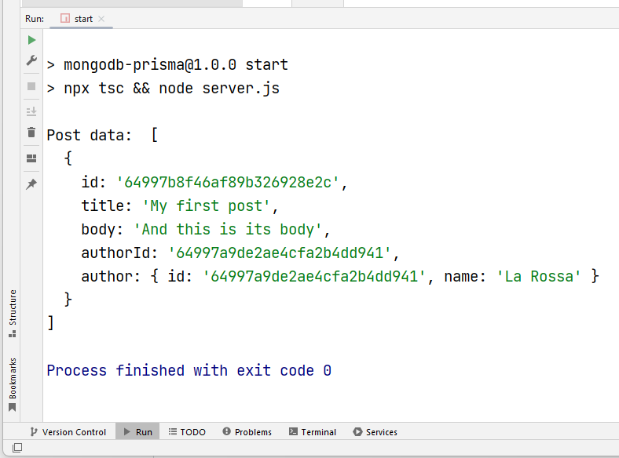
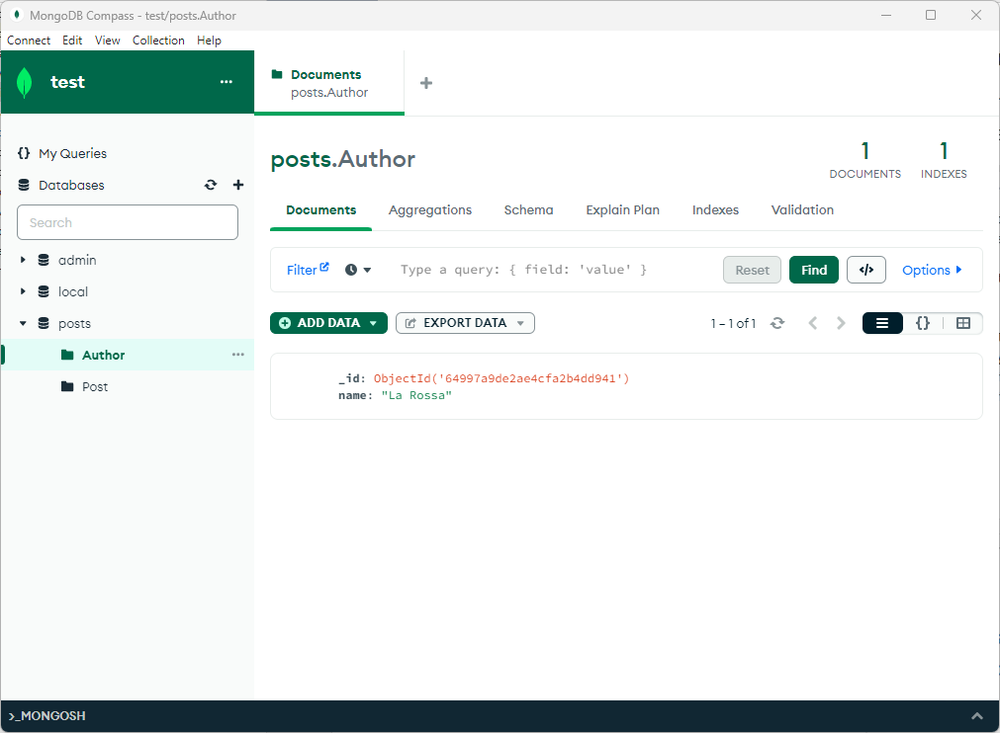

### Introduction to Prisma with MongoDB
I created this repo to create basic setup of using prisma, mongodb and typescript together.

##### Sources
- [Prisma Documentation](https://www.prisma.io/docs)
- [Mongodb Cloud](https://cloud.mongodb.com)

##### Extras
I used [mongodb compass](https://www.mongodb.com/products/compass) to compare and retrieve my data.

